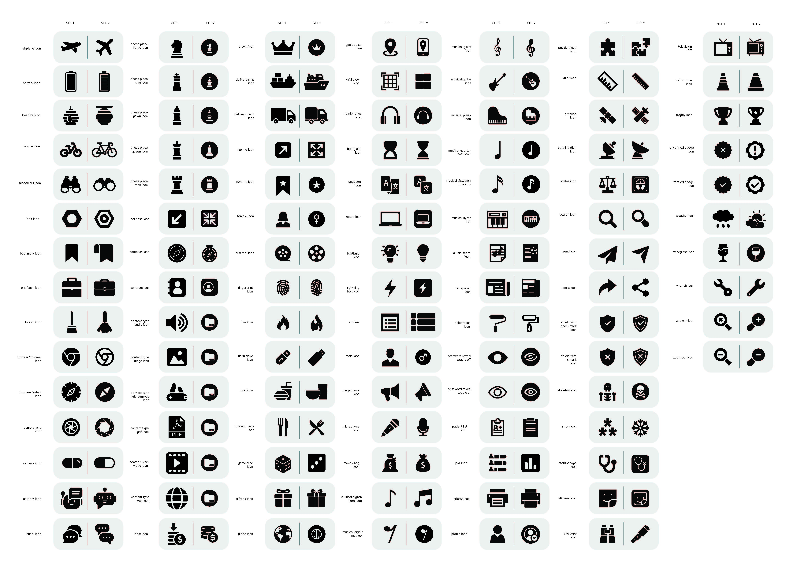

# Milkdromeda Icons

A collection of open-source icons for Flutter apps made by [Milkdromeda](https://milkdromeda.dev).



---

## Features

- **903 icons** across **9 font sets**
- **3 visual styles** for every icon family:
  - **Style 1 (outlined)** — Sets 1, 3, 5
  - **Style 2 (filled)** — Sets 2, 4, 6
  - **Style 3 (badge)** — Sets 7, 8, 9 — icon shape as a white cutout inside a solid rounded-square
- Covers UI actions, nature & animals, travel, music, healthcare, lifestyle, and more
- Pure icon font — scales to any size and respects theme color

---

## Installation

Add to your `pubspec.yaml`:

```yaml
dependencies:
  milkdromeda_icons: ^0.0.3+7
```

Then run:

```sh
flutter pub get
```

---

## Usage

```dart
import 'package:milkdromeda_icons/milkdromeda_icons.dart';

// Outlined style
Icon(MilkdromedaIcons.dolphin1)

// Filled style
Icon(MilkdromedaIcons.dolphin2)

// Badge style (new in 0.0.3+7)
Icon(MilkdromedaIcons.dolphin3)

// With color and size
Icon(
  MilkdromedaIcons.airplane3,
  color: Colors.white,
  size: 32,
)
```

---

## Icon Sets

| Sets | Style | Example icons |
|------|-------|---------------|
| 1 & 2 | Outlined / Filled | action, bell, camera, dolphin, snail, calendar, home, … |
| 3 & 4 | Outlined / Filled | airplane, bicycle, crown, chess pieces, musical notes, globe, … |
| 5 & 6 | Outlined / Filled | beds, antiseptic, nurse, cardiologist, pharmacy, backpack, … |
| 7, 8, 9 | **Badge** | All of the above in badge style (icon cutout in rounded square) |

Every icon in Sets 1–6 has a matching `*3` badge variant in Sets 7–9
(e.g. `dolphin1` → `dolphin2` → `dolphin3`).

---

## License

Open-source — see [LICENSE](LICENSE).
